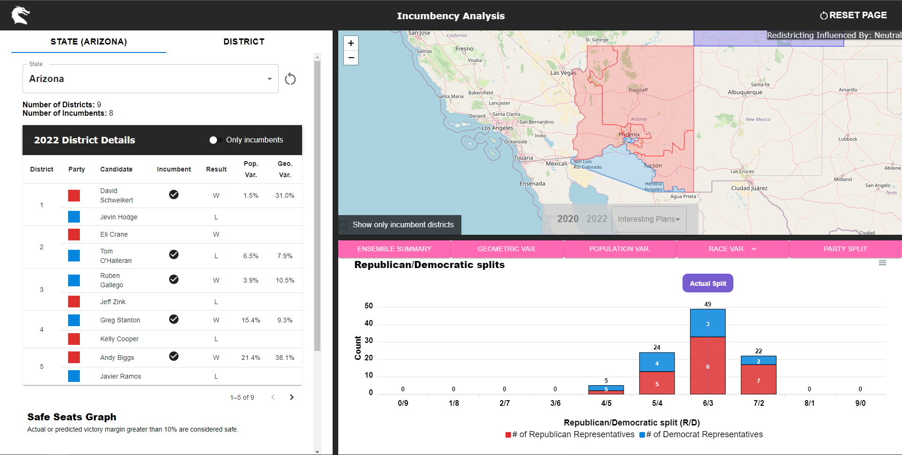
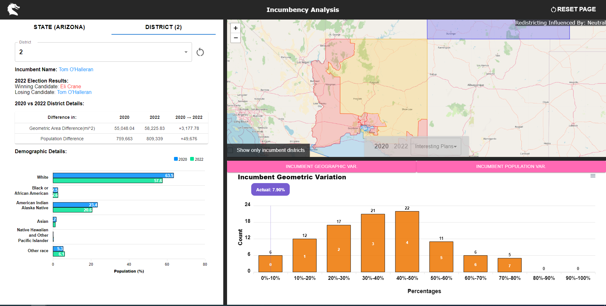

# IncumbencyAnalysis 🗳️📊

*Web app to analyze state redistricting maps between 2020 and 2022 to determine whether redistricting by parties had malicious intent to undermine voting power of certain candidates and prevent incumbency*

## Overview

IncumbencyAnalysis allows analysis of state redistricting maps between 2020 and 2022 across Arizona, Colorado, and Ohio. Using ensemble analysis with GerryChain algorithms, the platform compares congressional district maps to determine whether redistricting had any malicious intent to undermine the voting power of certain candidates to prevent incumbency.



## 🌟 Features

### 🗺️ **Interactive District Maps**
View congressional district boundaries with choropleth visualization showing 2020 vs 2022 redistricting comparisons and district-level demographic data.



### 📈 **Box & Whisker Analysis**
Statistical analysis of geometric, population, and demographic variations across ensemble-generated district plans using interactive box plot visualizations.

### 🎯 **Incumbent Impact Analysis**
Analysis of how redistricting affects incumbent candidate viability through detailed tabular data and variation metrics across demographic dimensions.

### 📊 **Demographic Variation Tracking**
Tracking of population distribution changes including White, Black, Hispanic, Asian, and age demographics between redistricting cycles.

### 🤖 **Ensemble Generation**
District plan generation using GerryChain's Markov Chain Monte Carlo algorithms for redistricting analysis.

### 🎛️ **State Management**
State management with Redux for data filtering, district selection, and component synchronization.

## 📊 Data Sources

- **Congressional District Boundaries**: 2020 and 2022 official redistricting plans for AZ, CO, OH
- **Precinct Demographics**: Voting age population by race/ethnicity from Census data
- **Precinct Neighbors**: Adjacency relationships for ensemble generation
- **Election Results**: 2020 presidential election data at precinct level

## 🛠️ Tech Stack

### **Frontend**
- **React 17**: Modern component-based architecture
- **Material-UI**: Responsive, accessible design system
- **Leaflet + React-Leaflet**: Interactive mapping and GeoJSON visualization
- **ApexCharts**: Statistical box plot visualizations
- **Redux**: Centralized state management

### **Backend**
- **Spring Boot + Java 17**: RESTful API server
- **MongoDB**: Document database for district and ensemble data
- **Gradle**: Build automation and dependency management

### **Analytics**
- **GerryChain**: Redistricting ensemble generation and analysis
- **GeoPandas**: Geospatial data processing
- **Python**: Data preprocessing and statistical analysis

## 🚀 Getting Started

```bash
# Clone the repository
git clone https://github.com/your-username/IncumbencyAnalysis.git
cd IncumbencyAnalysis

# Install frontend dependencies
cd client
npm install

# Start development server
npm start
```

Runs the app in development mode.
Open [http://localhost:3000](http://localhost:3000) to view it in your browser.

### Backend Setup
```bash
# Navigate to backend directory
cd server

# Install Java 17 and latest Gradle version
# Start backend server
./gradlew bootRun
```

The server runs on [http://localhost:8080](http://localhost:8080)

### Database Setup
```bash
# Create MongoDB database and collection named 'state'
# Import database.json into the collection

# Set up environment variables for MongoDB connection
```

## 📁 Project Structure

```
IncumbencyAnalysis/
├── client/
│   ├── src/
│   │   ├── components/          # Interactive visualization components
│   │   │   ├── Map.js          # Interactive district mapping
│   │   │   ├── BoxAndWhisker.js # Statistical analysis plots
│   │   │   ├── IncumbentTable.js # Incumbent impact analysis
│   │   │   ├── DemographicDetails.js # Population metrics
│   │   │   └── StateTab.js     # State-level overview
│   │   ├── store/              # Redux state management
│   │   └── App.js              # Main application component
│   └── public/                 # Static assets and screenshots
├── server/
│   ├── src/main/java/com/dragons/server/
│   │   ├── Controller.java     # REST API endpoints
│   │   ├── State.java          # State data models
│   │   ├── District.java       # District data models
│   │   └── Ensemble.java       # Ensemble analysis models
│   └── build.gradle            # Gradle build configuration
├── backend/
│   ├── preprocessing/          # Data preprocessing scripts
│   │   ├── files/             # Raw data files (shapefiles, CSV)
│   │   └── prepro.py          # Data cleaning and preparation
│   ├── seawulf*.py            # State-specific ensemble generation
│   └── calculate_box_whisker_data.py # Statistical calculations
```

## 🔧 Development Commands

```bash
# Frontend Development
cd client
npm start            # Start development server
npm run build        # Build for production

# Backend Development  
cd server
./gradlew bootRun    # Start Spring Boot server
./gradlew build      # Build JAR file

# Python Analysis
cd backend
python seawulf.py    # Generate ensemble analysis
python prepro.py     # Preprocess raw data
```

## 🙏 Acknowledgments

- **GerryChain** for redistricting analysis algorithms
- **Leaflet** for interactive mapping capabilities  
- **Material-UI** for beautiful, accessible components
- **Spring Boot** for robust backend development
- **React** for dynamic frontend interactions

---
